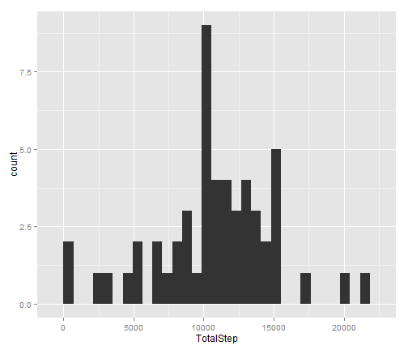
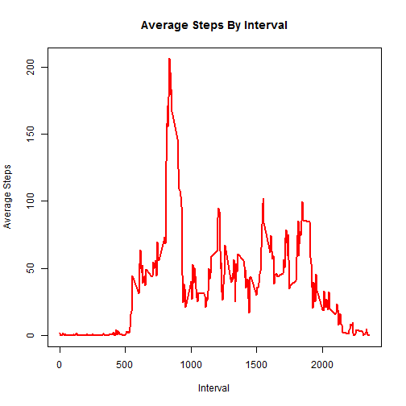
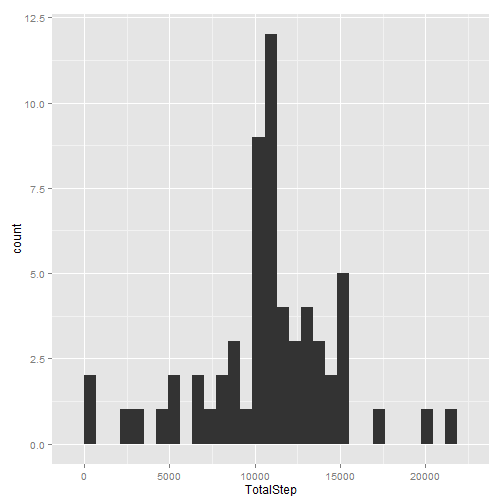
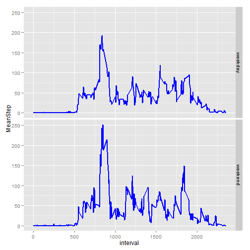

Title  Reproducible Research: Peer Assessment 1
========================================================

## Loading and preprocessing the data

```r
  pkg.plyr <- installed.packages("plyr")
  if (any(!(pkg.plyr))) {
    install.packages("plyr")
  }
  pkg.ggplot <- installed.packages("ggplot2")
  if (any(!(pkg.ggplot ))) {
    install.packages("ggplot2")
  }
  library("plyr")
  library("ggplot2")

  activitycsv <- read.csv("activity.csv",na.strings="NA", header=TRUE, sep=",", strip.white = FALSE,stringsAsFactors = FALSE)
```

## What is mean total number of steps taken per day?


```r
aggstep <- ddply(activitycsv, .(date = as.Date(date)), summarise,TotalStep = sum(steps))
ggplot(aggstep, aes(x=TotalStep)) + geom_histogram()
```

```
## stat_bin: binwidth defaulted to range/30. Use 'binwidth = x' to adjust this.
```

 

```r
 mean(aggstep$TotalStep, na.rm =TRUE)
```

```
## [1] 10766
```

```r
 median(aggstep$TotalStep, na.rm =TRUE)
```

```
## [1] 10765
```
## What is the average daily activity pattern?


```r
  aggstepinterval <- ddply(activitycsv, .(interval), summarise,Mean = mean(steps, na.rm = TRUE))

  plot(aggstepinterval$interval, aggstepinterval$Mean, type="l", lwd=2, col="red",  ylab='Average Steps',xlab='Interval' , main="Average Steps By Interval")
```

 

```r
 # 5-minute interval contains the maximum number of steps

  subset(aggstepinterval, max(aggstepinterval$Mean) == aggstepinterval$Mean )
```

```
##     interval  Mean
## 104      835 206.2
```
## Imputing missing values


```r
   NAActivity <- subset(activitycsv, is.na(activitycsv$steps) == TRUE)

# total number of missing values in the dataset (i.e. the total number of rows with NAs)
   dim(NAActivity)[1]
```

```
## [1] 2304
```

```r
# strategy for filling in all of the missing values in the dataset is  the mean for that 5-minute interval
  stepNAmerge <- merge(NAActivity,aggstepinterval, by.x="interval", by.y="interval" )
  
  stepNAmerge$steps <- NULL
  colnames(stepNAmerge)[3] <- "steps"
  actmergedata <- rbind(activitycsv,stepNAmerge)

# new dataset that is equal to the original dataset but with the missing data filled in

  imputeactivity <- subset(actmergedata, is.na(steps)==FALSE)
  imputeactivityorder <- imputeactivity[with(imputeactivity, order(date, interval)), ]

#histogram of the total number of steps taken each day

  aggstepimpute <- ddply(imputeactivityorder, .(date = as.Date(date)), summarise,TotalStep = sum(steps))

  ggplot(aggstepimpute, aes(x=TotalStep)) + geom_histogram()
```

```
## stat_bin: binwidth defaulted to range/30. Use 'binwidth = x' to adjust this.
```

 

```r
# report the mean and median total number of imputed data

  mean(aggstepimpute$TotalStep, na.rm =TRUE)
```

```
## [1] 10766
```

```r
  median(aggstepimpute$TotalStep, na.rm =TRUE)
```

```
## [1] 10766
```
## Are there differences in activity patterns between weekdays and weekends?


```r
# new factor dataset with two levels ??? ???weekday??? and ???weekend??? indicating whether a given date is a weekday or weekend day.

  imputeactweektype <- transform(imputeactivityorder, weekdaytype=as.POSIXlt(date, format='%Y-%m-%d')$wday %in% c(1, 5))

  imputeactweektype$weekdaytype[imputeactweektype$weekdaytype== FALSE] <- 'weekday'

  imputeactweektype$weekdaytype[imputeactweektype$weekdaytype== TRUE] <- 'weekend'

# aggregate the average number of steps taken, averaged across all weekday days or weekend days

  aggactweektype <- ddply(imputeactweektype, .(weekdaytype,interval), summarise,MeanStep = mean(steps))

# plot the graph to show weekend and weekday activity

  ggplot(aggactweektype, aes(interval, MeanStep)) + geom_line(col='blue', lwd = .75) + facet_grid(weekdaytype ~ .)
```

 
